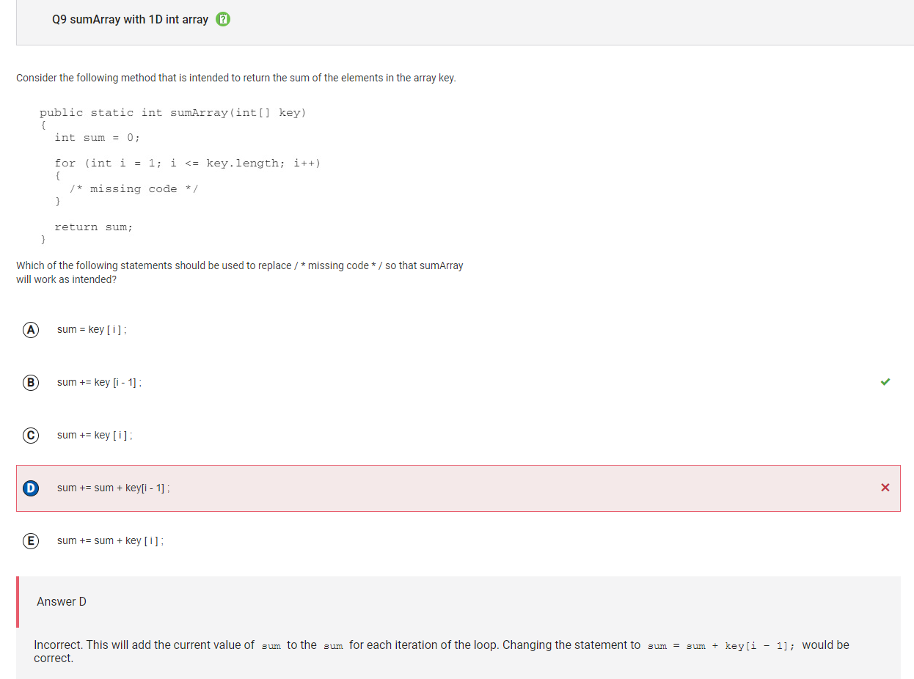
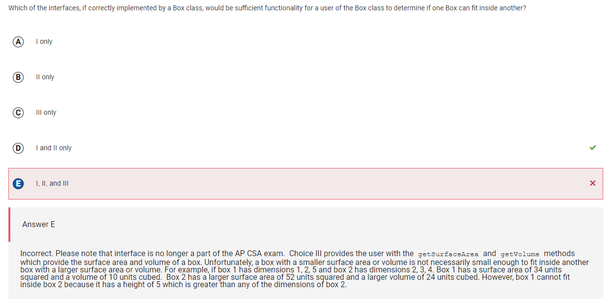
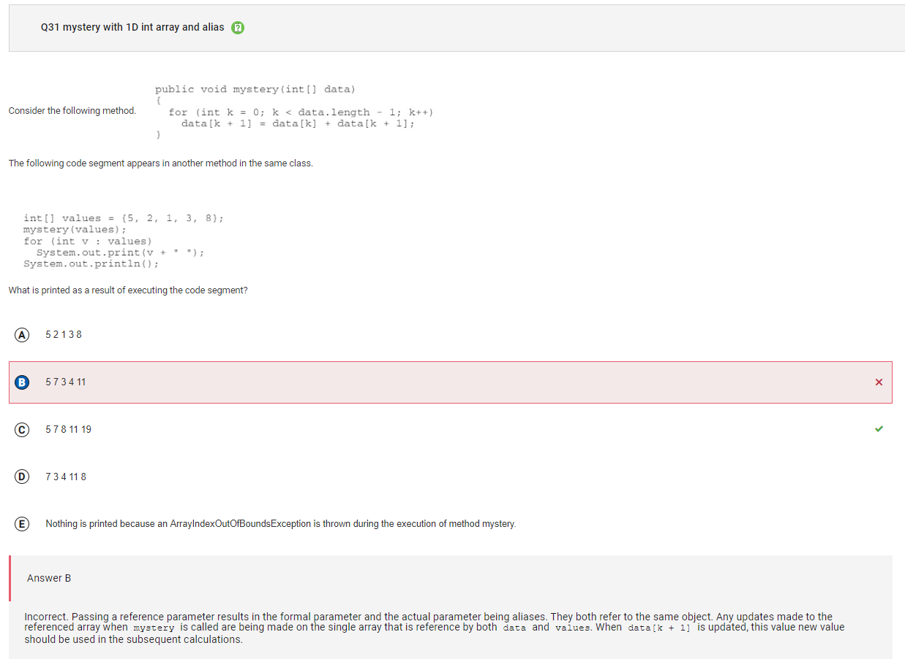
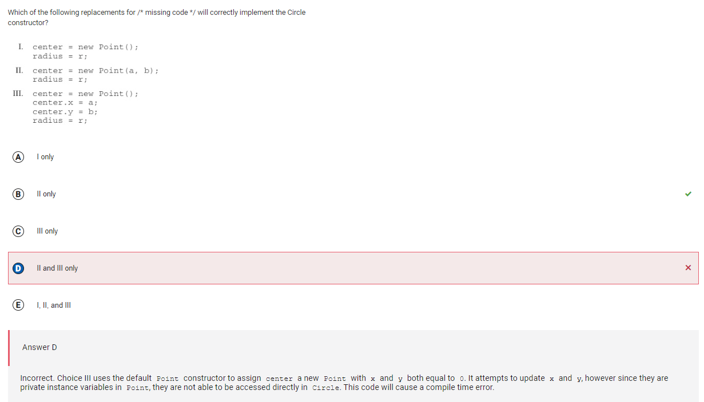
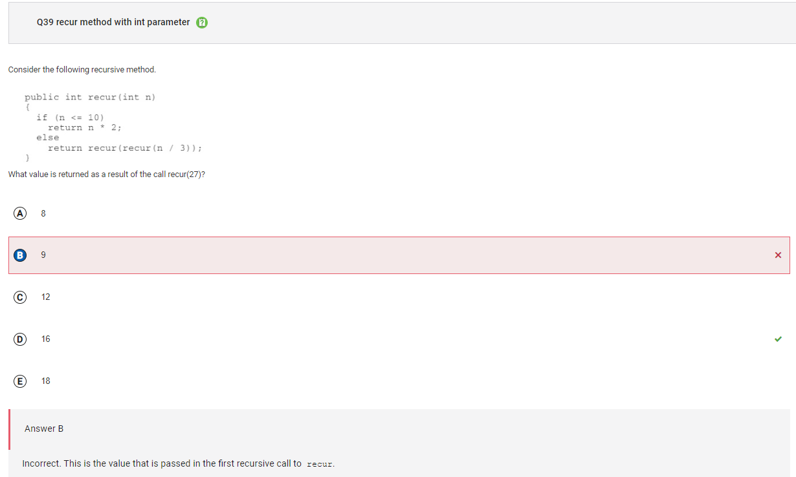

## Overall Score: 35/40
- Fairly easy, concepts weren't too hard
- A lot easier than some of the FRQs

## Corrections
<h4> Question 9 </h4>

- silly mistake
- not supposed to add the sum each time
  
<h4> Question 25 </h4>

- you can't compare the sizes of the boxes based on the surface area and width alone, you need to compare the dimensions themselves
- This is why choice 3 is not viable, but one and two are

<h4> Question 31 </h4>

- when doing logic calculations, I misinterpreted data[k + 1] so I didn't take in the next value in the calculations
- again a simple mistake not a conceptual mistake

<h4> Question 34 </h4>

- It is not option 3 because the x and y values are private so they can't be updated within the method

<h4> Question 39 </h4>
